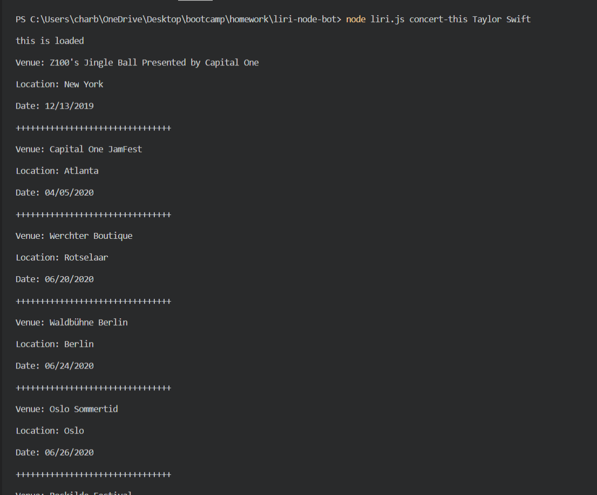
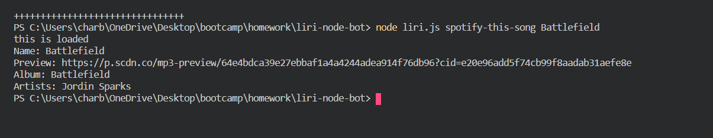
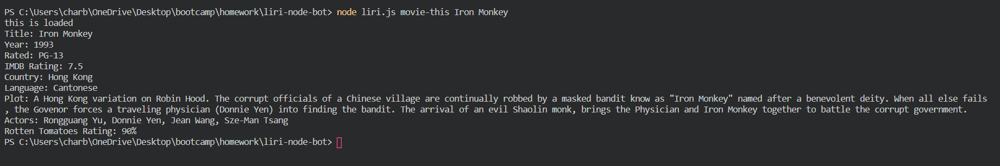
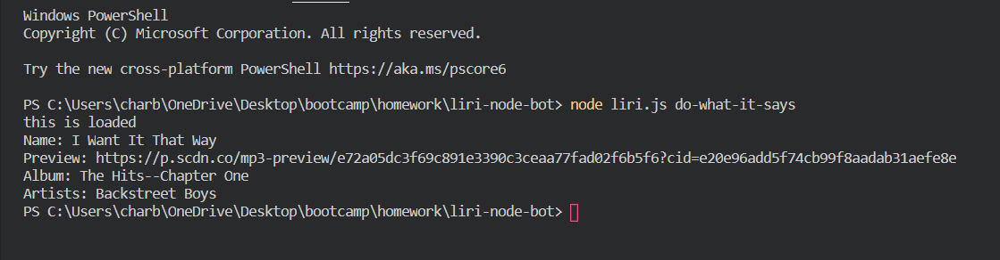

# LIRI Bot

LIRI is a Language Interpretation and Recognition Interface that uses Node.js to take in parameters and renders specific information.

## Tech Used

-Node.js
-Spotify API
-Band in Town Artist Events API
-OMDb API
-fs path

## How it works
1.To find a concert of an artist or band, insert `node liri.js concert-this <artist/band name here>` into the command line. Using the Band in Town Artist Events API, LIRI will then provide results that include:

     - Name of the venue

     - Venue location

     - Date of the Event (use moment to format this as "MM/DD/YYYY")

2.To find a song insert `node liri.js spotify-this-song '<song name here>'`. LIRI will use the Spotify API to render information to the terminal that includes:

     - Artist(s)

     - The song's name

     - A preview link of the song from Spotify

     - The album that the song is from

 If no song is provided then LIRI will default to "The Sign" by Ace of Base.

3. To find movie information insert `node liri.js movie-this '<movie name here>'`. Using the OMDb API, LIRI will render the following information:

    -Title of the movie.
    -Year the movie came out.
    -IMDB Rating of the movie.
    -Rotten Tomatoes Rating of the movie.
    -Country where the movie was produced.
    -Language of the movie.
    -Plot of the movie.
    -Actors in the movie.

If no movie is put in, LIRI will output data for the movie 'Mr. Nobody.'

4.  The last command that LIRI can take is `node liri.js do-what-it-says`. This command uses the `fs` Node package and takes the text from inside of the file random.txt and use that information to call one of LIRI's commands. 

The information that is currently in random.txt is "I Want it That Way", so LIRI will use the Spotify API to find information on I Want it That Way.

    
## Images

- `concert-this`

- `spotify-this-song`

- `movie-this`

- `do-what-it-says`

## Links
 -[GitHub Repo](https://github.com/charbeaty/liri-node-bot.git)

